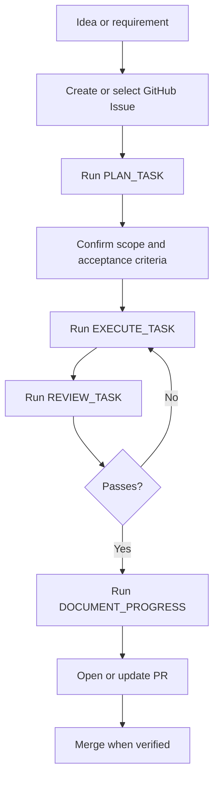
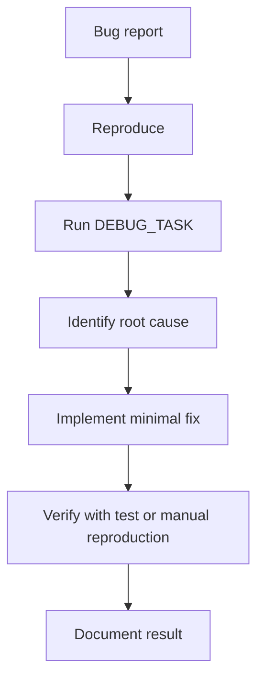
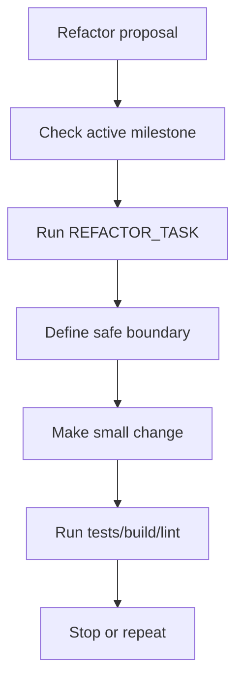
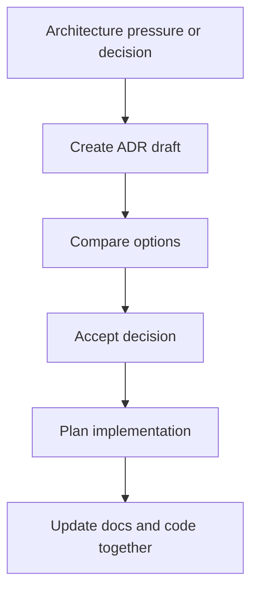

# AI Development Workflow

This document explains how AI agents and human collaborators should use project context, prompts, documentation, and GitHub workflow in Kader Club.

It complements `AGENTS.md`. `AGENTS.md` defines repository-wide operating rules. This document defines the repeatable workflow system.

## Executive Summary

Kader Club should use a small, layered context system:

1. `AGENTS.md` tells every AI agent how to behave in the repository.
2. Product and technical docs explain stable project knowledge.
3. `docs/prompts/` contains task prompts for planning, execution, review, debugging, refactoring, and progress documentation.
4. GitHub Issues define task-specific scope.
5. Pull Requests prove that a change was implemented, verified, and documented.

The goal is to prevent AI agents from guessing, overbuilding, duplicating context, or drifting away from the MVP.

## Source of Truth Order

When instructions conflict, use this order:

1. `AGENTS.md`
2. `README.md`
3. `ROADMAP.md`
4. Relevant product, architecture, data, or project-management docs under `docs/`
5. Relevant GitHub Issue
6. Task prompt from `docs/prompts/`
7. Current chat instruction

The current chat instruction can refine a task, but it should not silently override MVP scope, security rules, or architectural decisions.

## Memory Hierarchy

| Layer | File or Location | Purpose | Update Frequency |
|---|---|---|---|
| Repository instructions | `AGENTS.md` | Global AI and collaborator rules | Rarely, only when workflow rules change |
| Product identity | `README.md` | Project mission, MVP goal, current priority | When positioning or priority changes |
| Product roadmap | `ROADMAP.md` | Phase sequencing and milestone scope | At phase or milestone changes |
| Product strategy | `docs/product-strategy.md` | Personas, positioning, principles, metrics | When strategy changes |
| Requirements | `docs/requirements.md` | MVP scope and acceptance criteria | When product behavior changes |
| Architecture | `docs/architecture.md` | System architecture and engineering assumptions | When architecture changes |
| Data model | `docs/data-model.md` | Tables, fields, catalog model, trade/pricing concepts | When schema changes |
| Project management | `docs/project-management.md` | Issues, labels, milestones, board flow | When workflow changes |
| Decisions | `docs/decisions/` | ADRs for important product and technical decisions | Whenever a decision has long-term impact |
| Prompts | `docs/prompts/` | Reusable task prompts for AI agents | When workflow improves |
| Issues | GitHub Issues | Task-specific goal, scope, acceptance criteria | Every meaningful task |
| Pull Requests | GitHub PRs | Implementation, verification, review, traceability | Every code or doc change |

## What Goes Where

### Stable Memory

Store stable facts in documentation:

- Product mission
- MVP scope and non-goals
- Architecture direction
- Database model
- Security principles
- Domain terminology
- Accepted decisions
- Project workflow rules

### Task-Specific Context

Store task-specific context in GitHub Issues or chat prompts:

- Current bug report
- Feature request
- Files to modify
- Acceptance criteria for one task
- Edge cases found during implementation
- Temporary constraints

### Progress Context

Store progress in Issues, PRs, and changelog entries:

- What changed
- What remains incomplete
- How it was verified
- Follow-up tasks
- Known blockers

### Avoid Duplicating

Do not duplicate these across many files:

- MVP scope lists
- Data model definitions
- Architecture decisions
- Label systems
- Definition of Done

Instead, reference the source file.

## Recommended Workflow

### Feature Development

### Bug Fixing

### Refactoring

### Architecture Changes

## Prompt Usage Sequence

Use prompts from `docs/prompts/` in this order:

1. `CODEX_MASTER_PROMPT.md` — start a new AI coding session.
2. `PLAN_TASK.md` — turn a goal into an implementation plan.
3. `EXECUTE_TASK.md` — implement one focused task.
4. `REVIEW_TASK.md` — verify correctness, scope, security, and maintainability.
5. `DOCUMENT_PROGRESS.md` — update Issues, PR notes, docs, and changelog.

Use specialized prompts when needed:

- `DEBUG_TASK.md` for defects.
- `REFACTOR_TASK.md` for safe cleanup.

## Definition of Done

A task is done only when:

- The issue acceptance criteria are met or explicitly marked incomplete.
- The implementation remains inside MVP scope.
- Tests, linting, and build checks pass where available.
- RLS and authorization are considered for user-owned data.
- Documentation is updated when behavior, data model, architecture, scope, pricing, trade logic, or security assumptions change.
- The PR explains what changed, why, how it was verified, and what remains.

## AI Agent Coordination

### ChatGPT

Best for:

- Product thinking
- Planning
- Architecture review
- Prompt design
- Documentation strategy
- Issue decomposition

Avoid using it as the only source for implementation correctness. Pair it with tests, repository context, and review prompts.

### Codex

Best for:

- Repository-aware implementation
- Creating branches and PRs
- Running tests
- Applying focused code changes
- Updating docs with implementation

Codex should receive small tasks with clear files, acceptance criteria, and verification commands.

### Claude

Best for:

- Long-document review
- Requirements critique
- UX copy critique
- Architecture trade-off discussion
- Refactoring analysis

Use Claude for second-opinion reviews, not as a replacement for repository checks.

### Cursor

Best for:

- Interactive local editing
- Component-level work
- Fast file navigation
- Small refactors
- Manual debugging loops

Use Cursor when you want to stay in control of edits while receiving local suggestions.

## Anti-Patterns to Avoid

- Creating prompts that restate the whole project every time.
- Letting AI invent requirements not present in Issues or docs.
- Adding marketplace, payments, or complex social features during MVP work.
- Updating code without updating docs when the behavior changes.
- Creating broad refactors without tests or rollback boundaries.
- Splitting the app into services before the modular monolith proves insufficient.
- Treating pricing estimates as exact market truth.

## Practical Operating Loop

At the start of each work session:

1. Read `AGENTS.md`.
2. Read the active issue.
3. Read only the relevant docs.
4. Use `PLAN_TASK.md` if the implementation path is unclear.
5. Use `EXECUTE_TASK.md` for one focused change.
6. Use `REVIEW_TASK.md` before opening a PR.
7. Use `DOCUMENT_PROGRESS.md` before ending the session.

## Maintenance Rule

Keep the system boring and useful. Add a new document or prompt only when it removes repeated work, prevents mistakes, or improves traceability.
